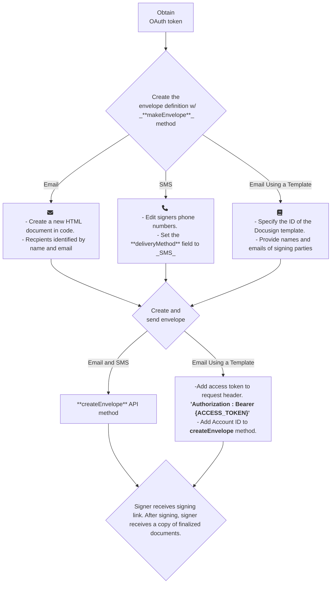

# **Interactive Documentation** 
**Objective:** Select **static** technical content and create an interactive educational component for the documentation

**Technical Content:** 
I selected Docusign documentation on how to send a signature request via [email](https://developers.docusign.com/docs/esign-rest-api/how-to/request-signature-email-remote/), [SMS](https://developers.docusign.com/docs/esign-rest-api/how-to/request-signature-sms-whatsapp/), or [template](https://developers.docusign.com/docs/esign-rest-api/how-to/request-signature-template-remote/). 

**Interactive Documentation:**
I combined DocuSign's three workflows into one flowchart to outline the different ways users can send documents for signature requests.

